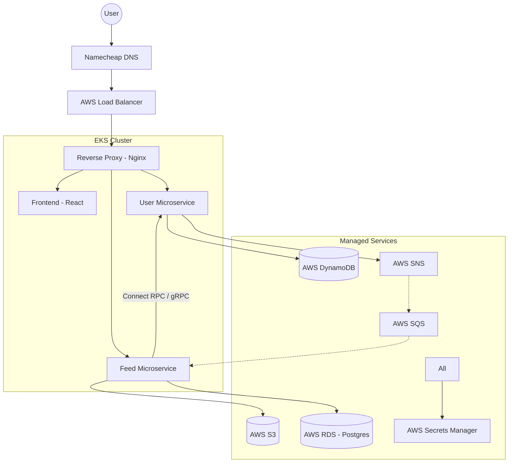

# 🏙️ Udagram - Full Stack Cloud Developer Capstone

[](https://github.com/jandiralceu/udagram/actions/workflows/ci.yml)
[](https://github.com/jandiralceu/udagram/actions/workflows/cd.yml)

**Udagram** is a production-grade, microservice-based social media application built as the final project for the Udacity Cloud Developer Nanodegree. It demonstrates advanced skills in **Full Stack Development**, **Microservices Architecture**, **Cloud Orchestration (AWS EKS)**, and **DevOps (CI/CD)**.

---

## 🚀 Live Access

- **Frontend Application**: [http://udagram.jandir.site](http://udagram.jandir.site)
- **Unified API Gateway**: [http://udagramapi.jandir.site/api/v1](http://udagramapi.jandir.site/api/v1)
- **API Documentation**: [Swagger/OpenAPI](http://udagramapi.jandir.site/docs)

---

## 🏗️ System Architecture

The project uses a **Monorepo** approach to manage multiple microservices, shared packages, and infrastructure code in a single, high-performance workspace.



---

## 🛠 Tech Stack

- **Core**: TypeScript, Node.js, Fastify.
- **Frontend**: React 19, Material UI, Vite, TanStack Router/Query.
- **Data & Storage**: PostgreSQL (Drizzle ORM), DynamoDB, AWS S3.
- **RPC & Messaging**: Connect Protocol (gRPC compatible), AWS SNS/SQS.
- **Security**: JWT (RS256 Asymmetric Signing), AWS Secrets Manager.
- **Infra & DevOps**: Docker, Kubernetes (EKS), GitHub Actions, Turborepo.

---

## 📦 Monorepo Structure

Developed using **npm Workspaces** and **Turborepo** for optimized builds and caching.

- `apps/udagram-frontend`: Modern React SPA.
- `apps/udagram-api-user`: Identity and profile microservice.
- `apps/udagram-api-feed`: Content and media management microservice.
- `apps/udagram-reverseproxy`: Nginx-based API Gateway.
- `packages/*`: Shared logic for logging, cloud providers, and gRPC definitions.
- `k8s/`: Kubernetes manifests for EKS orchestration.

---

## ⚙️ Development Workflow

### Root Commands

Perform actions across the entire monorepo simultaneously:

```bash
# Install dependencies for all apps/packages
npm install

# Start all services in development mode
npm run dev

# Run tests and linting across the workspace
npm test
npm run lint

# Build all applications for production
npm run build
```

### Git & Conventional Commits

We enforce high-quality commit standards using **Husky** and **Commitlint**. Every commit must follow the [Conventional Commits](https://www.conventionalcommits.org/) specification (e.g., `feat:`, `fix:`, `docs:`).

- **Lint-staged**: Automatically runs ESLint, Prettier, and related tests on changed files before every commit.

---

## 🔄 CI/CD Pipeline

The project implements a **Zero-Downtime Deployment** workflow via GitHub Actions:

1.  **Continuous Integration (CI)**: On every Pull Request, the pipeline runs linting, type-checking, and unit tests across all services.
2.  **Continuous Deployment (CD)**: On every push to the `main` branch:
    - **Dockerization**: Builds and tags multi-stage Docker images for each service.
    - **Registry**: Pushes images to **Docker Hub**.
    - **EKS Sync**: Updates Kubernetes deployments in the AWS cluster using a **Rolling Update** strategy.

---

## 📑 Project Evidence

For a detailed breakdown of how this project meets the Cloud Developer Rubric requirements, including screenshots of HPA, monitoring, and deployment logs, please refer to:

👉 **[RUBRIC.md](./RUBRIC.md)**

---

## 👨‍💻 Author

**Jandir A. Cutabiala**  
Cloud Developer & Backend Engineer  
[LinkedIn](https://www.linkedin.com/in/jandiralceu/) | [GitHub](https://github.com/jandiralceu)
