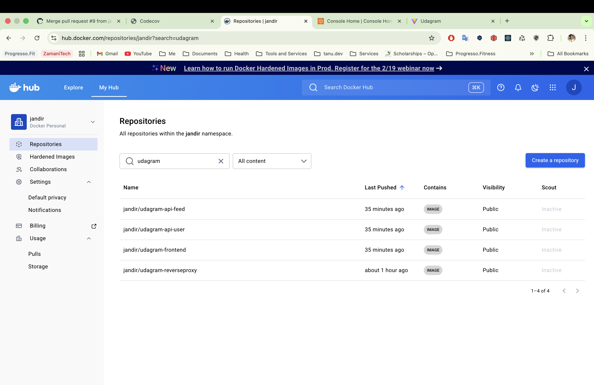
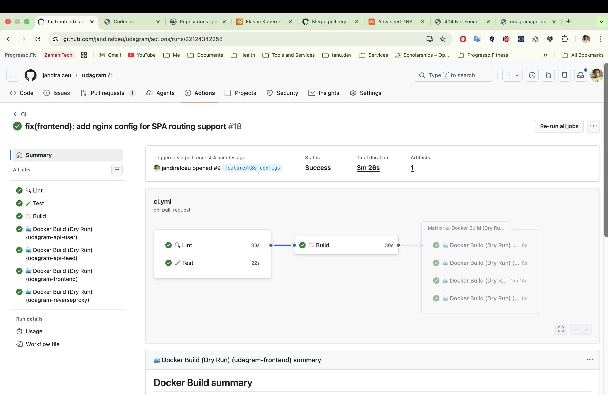
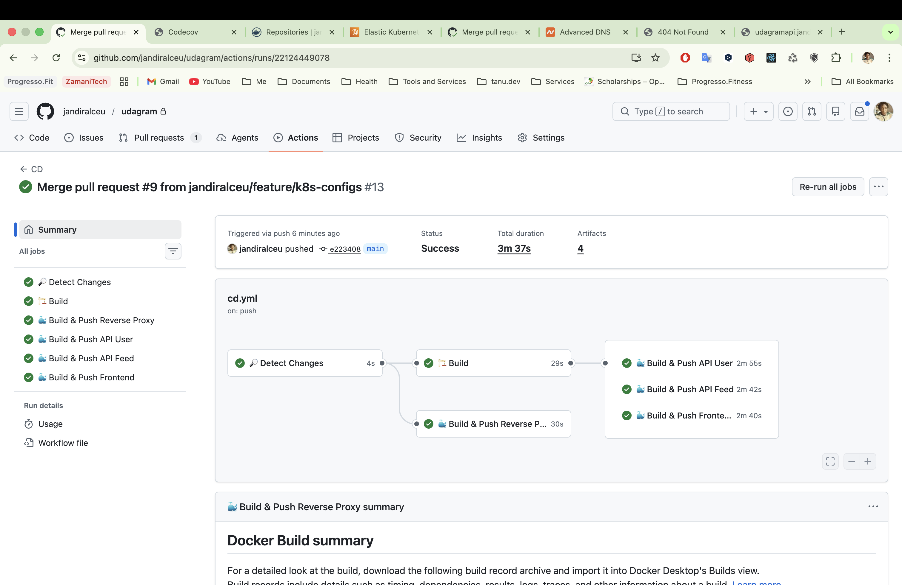
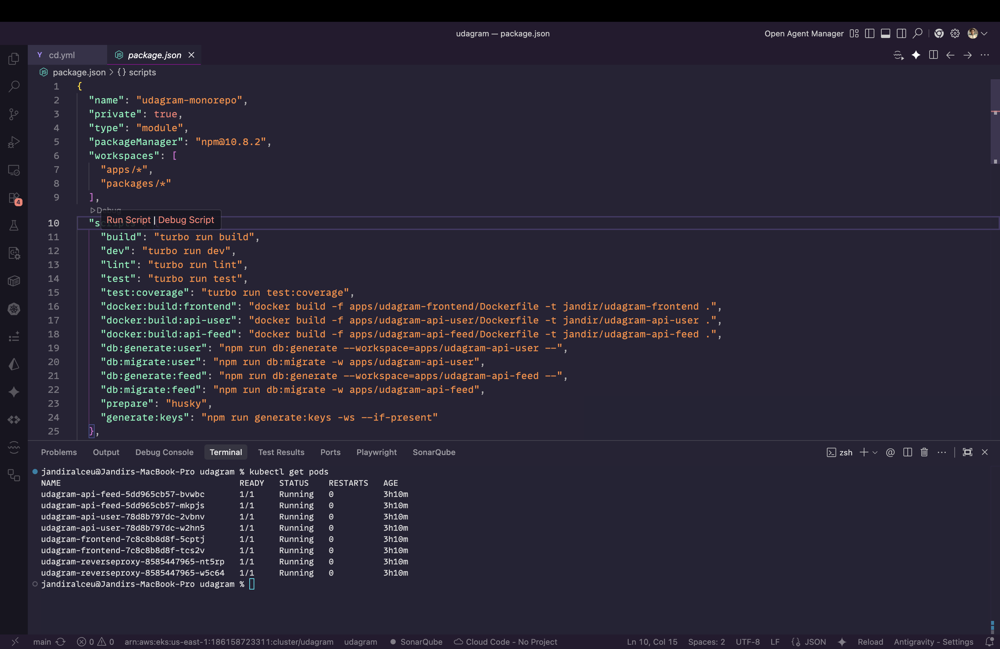
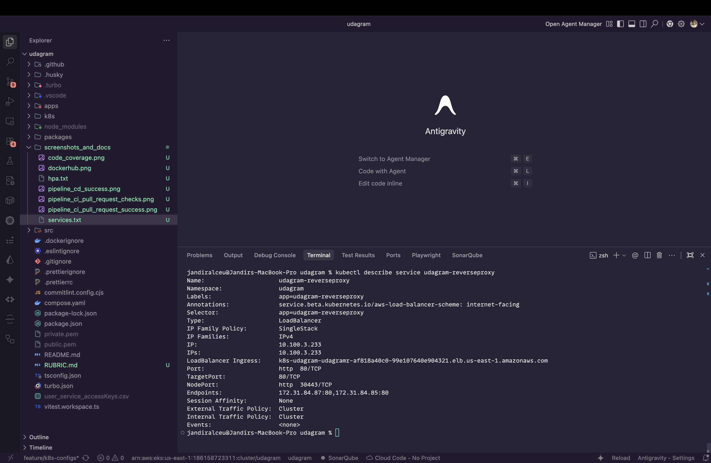
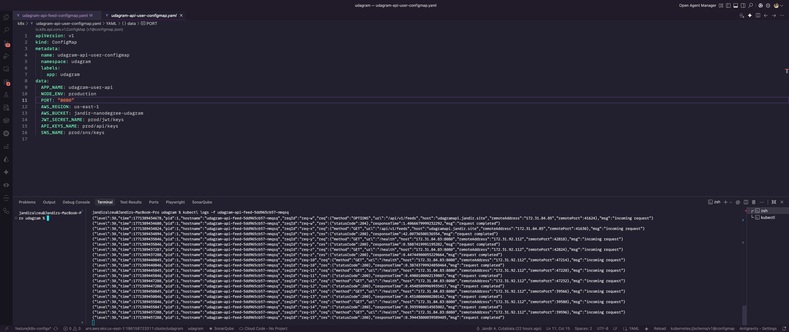
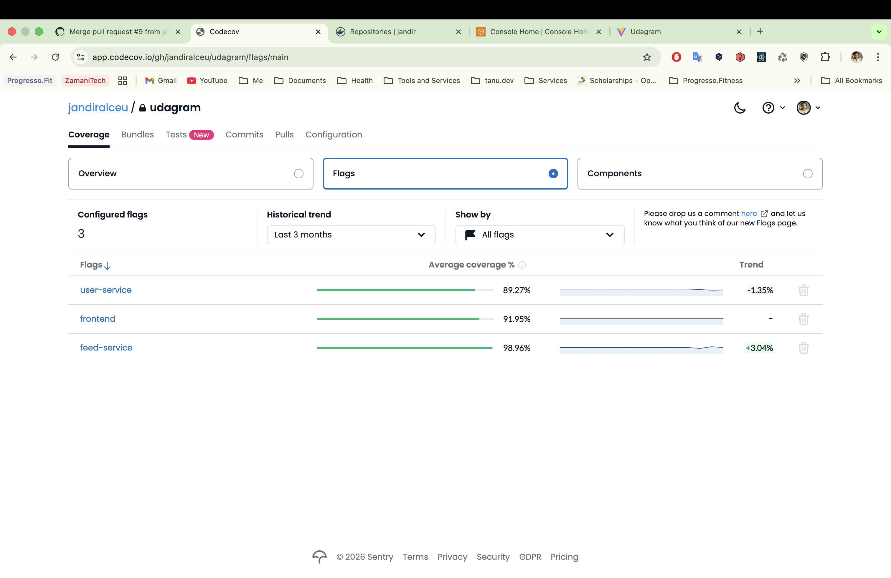
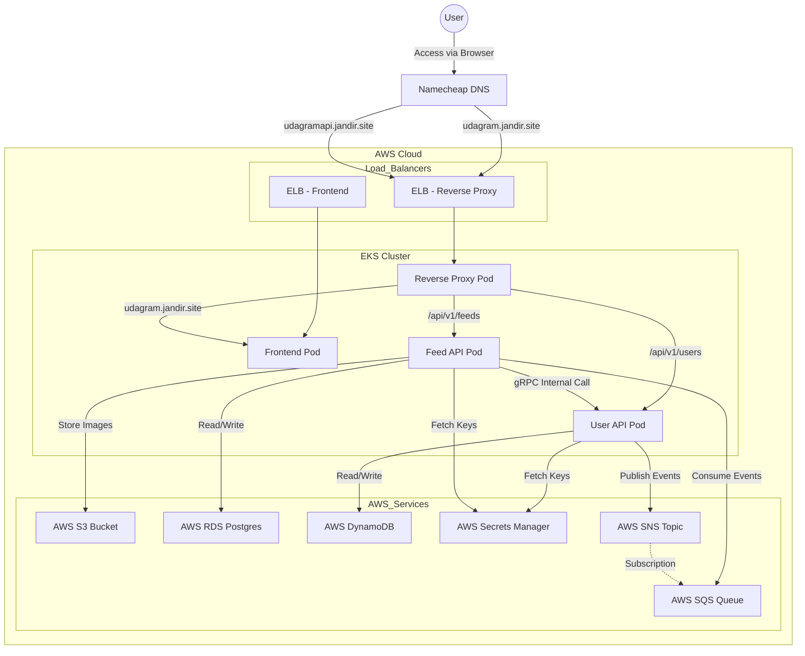

# Udagram Project Rubric & Evidence

This document maps the project requirements to the evidence collected during development and deployment.

---

## 1. Containers and Microservices

### 🔹 Divide an application into microservices

**Status:** ✅ Implemented
**Requirement:** `/feed` and `/user` backends are separated into independent projects.
**Evidence:**
The application is structured as a monorepo with distinct applications for each microservice:

- `apps/udagram-api-feed`: Handles feed items and resource processing.
- `apps/udagram-api-user`: Handles user authentication and profiles.
- `apps/udagram-frontend`: The React frontend application.

### 🔹 Build and run a container image using Docker

**Status:** ✅ Implemented
**Requirement:** Project includes Dockerfiles to successfully create Docker images for `/feed`, `/user` backends, project frontend, and reverse proxy.
**Evidence:**
Docker images are built and pushed to Docker Hub.


---

## 2. Independent Releases and Deployments

### 🔹 Use Travis (GitHub Actions) to build a CI/CD pipeline

**Status:** ✅ Implemented
**Requirement:** Project includes a CI/CD pipeline configuration.
**Evidence:**
We utilize **GitHub Actions** for a robust CI/CD pipeline, handling Linting, Testing, Building, and Deployment.

**CI Pipeline (Pull Request Success):**


**CD Pipeline (Deployment Success):**


---

## 3. Service Orchestration with Kubernetes

### 🔹 Deploy microservices using a Kubernetes cluster on AWS

**Status:** ✅ Implemented
**Requirement:** Screenshots of kubectl commands show the Frontend and API projects deployed in Kubernetes.
**Evidence:**
The following output from `kubectl get pods` confirms that all microservices (User API, Feed API, Frontend, and Reverse Proxy) are in the **Running** state with appropriate replicas.



The following output from `kubectl describe services` confirms the network deployment of User API, Feed API, Frontend, and Reverse Proxy.

```text
Name:                     udagram-api-feed
Namespace:                udagram
Labels:                   app=udagram-api-feed
Annotations:              <none>
Selector:                 app=udagram-api-feed
Type:                     ClusterIP
IP Family Policy:         SingleStack
IP Families:              IPv4
IP:                       10.100.202.200
IPs:                      10.100.202.200
Port:                     http  8080/TCP
TargetPort:               8080/TCP
Endpoints:                172.31.84.80:8080,172.31.84.91:8080
Session Affinity:         None
Internal Traffic Policy:  Cluster
Events:                   <none>


Name:                     udagram-api-user
Namespace:                udagram
Labels:                   app=udagram-api-user
Annotations:              <none>
Selector:                 app=udagram-api-user
Type:                     ClusterIP
IP Family Policy:         SingleStack
IP Families:              IPv4
IP:                       10.100.163.183
IPs:                      10.100.163.183
Port:                     http  8080/TCP
TargetPort:               8080/TCP
Endpoints:                172.31.84.82:8080,172.31.84.90:8080
Session Affinity:         None
Internal Traffic Policy:  Cluster
Events:                   <none>


Name:                     udagram-frontend
Namespace:                udagram
Labels:                   app=udagram-frontend
Annotations:              service.beta.kubernetes.io/aws-load-balancer-scheme: internet-facing
Selector:                 app=udagram-frontend
Type:                     LoadBalancer
IP Family Policy:         SingleStack
IP Families:              IPv4
IP:                       10.100.8.199
IPs:                      10.100.8.199
LoadBalancer Ingress:     k8s-udagram-udagramf-e0a4a01604-6bb24d0ff41bd2db.elb.us-east-1.amazonaws.com
Port:                     http  80/TCP
TargetPort:               80/TCP
NodePort:                 http  32501/TCP
Endpoints:                172.31.84.88:80,172.31.84.89:80
Session Affinity:         None
External Traffic Policy:  Cluster
Internal Traffic Policy:  Cluster
Events:                   <none>


Name:                     udagram-reverseproxy
Namespace:                udagram
Labels:                   app=udagram-reverseproxy
Annotations:              service.beta.kubernetes.io/aws-load-balancer-scheme: internet-facing
Selector:                 app=udagram-reverseproxy
Type:                     LoadBalancer
IP Family Policy:         SingleStack
IP Families:              IPv4
IP:                       10.100.3.233
IPs:                      10.100.3.233
LoadBalancer Ingress:     k8s-udagram-udagramr-af818a40c0-99e107640e904321.elb.us-east-1.amazonaws.com
Port:                     http  80/TCP
TargetPort:               80/TCP
NodePort:                 http  30443/TCP
Endpoints:                172.31.84.87:80,172.31.84.85:80
Session Affinity:         None
External Traffic Policy:  Cluster
Internal Traffic Policy:  Cluster
Events:                   <none>
```

### 🔹 Use a reverse proxy to direct requests to the appropriate backend

**Status:** ✅ Implemented
**Requirement:** Screenshot of Kubernetes services shows a reverse proxy.
**Evidence:**
The Reverse Proxy is deployed as a LoadBalancer service, routing traffic to internal services.


### 🔹 Configure scaling and self-healing for each service

**Status:** ✅ Implemented
**Requirement:** Kubernetes services are replicated. At least one of the Kubernetes services has replicas defined with a value greater than 1. Autoscaling configured with CPU metrics.
**Evidence:**
Horizontal Pod Autoscaler (HPA) is configured for all services.

```text
Name:                                                  udagram-api-feed-hpa
Namespace:                                             udagram
Labels:                                                <none>
Annotations:                                           <none>
CreationTimestamp:                                     Tue, 17 Feb 2026 23:16:32 -0300
Reference:                                             Deployment/udagram-api-feed
Metrics:                                               ( current / target )
  resource cpu on pods  (as a percentage of request):  1% (1m) / 70%
Min replicas:                                          2
Max replicas:                                          5
Deployment pods:                                       2 current / 2 desired
Conditions:
  Type            Status  Reason            Message
  ----            ------  ------            -------
  AbleToScale     True    ReadyForNewScale  recommended size matches current size
  ScalingActive   True    ValidMetricFound  the HPA was able to successfully calculate a replica count from cpu resource utilization (percentage of request)
  ScalingLimited  True    TooFewReplicas    the desired replica count is less than the minimum replica count
Events:
  Type     Reason                        Age                 From                       Message
  ----     ------                        ----                ----                       -------
  Warning  FailedGetResourceMetric       44m (x2 over 108m)  horizontal-pod-autoscaler  failed to get cpu utilization: did not receive metrics for targeted pods (pods might be unready)
  Warning  FailedComputeMetricsReplicas  44m (x2 over 108m)  horizontal-pod-autoscaler  invalid metrics (1 invalid out of 1), first error is: failed to get cpu resource metric value: failed to get cpu utilization: did not receive metrics for targeted pods (pods might be unready)


Name:                                                  udagram-api-user-hpa
Namespace:                                             udagram
Labels:                                                <none>
Annotations:                                           <none>
CreationTimestamp:                                     Tue, 17 Feb 2026 23:16:36 -0300
Reference:                                             Deployment/udagram-api-user
Metrics:                                               ( current / target )
  resource cpu on pods  (as a percentage of request):  1% (1m) / 70%
Min replicas:                                          2
Max replicas:                                          5
Deployment pods:                                       2 current / 2 desired
Conditions:
  Type            Status  Reason            Message
  ----            ------  ------            -------
  AbleToScale     True    ReadyForNewScale  recommended size matches current size
  ScalingActive   True    ValidMetricFound  the HPA was able to successfully calculate a replica count from cpu resource utilization (percentage of request)
  ScalingLimited  True    TooFewReplicas    the desired replica count is less than the minimum replica count
Events:
  Type     Reason                        Age                 From                       Message
  ----     ------                        ----                ----                       -------
  Warning  FailedGetResourceMetric       45m (x2 over 108m)  horizontal-pod-autoscaler  failed to get cpu utilization: did not receive metrics for targeted pods (pods might be unready)
  Warning  FailedComputeMetricsReplicas  45m (x2 over 108m)  horizontal-pod-autoscaler  invalid metrics (1 invalid out of 1), first error is: failed to get cpu resource metric value: failed to get cpu utilization: did not receive metrics for targeted pods (pods might be unready)


Name:                                                  udagram-frontend-hpa
Namespace:                                             udagram
Labels:                                                <none>
Annotations:                                           <none>
CreationTimestamp:                                     Tue, 17 Feb 2026 23:16:38 -0300
Reference:                                             Deployment/udagram-frontend
Metrics:                                               ( current / target )
  resource cpu on pods  (as a percentage of request):  2% (1m) / 70%
Min replicas:                                          2
Max replicas:                                          5
Deployment pods:                                       2 current / 2 desired
Conditions:
  Type            Status  Reason            Message
  ----            ------  ------            -------
  AbleToScale     True    ReadyForNewScale  recommended size matches current size
  ScalingActive   True    ValidMetricFound  the HPA was able to successfully calculate a replica count from cpu resource utilization (percentage of request)
  ScalingLimited  True    TooFewReplicas    the desired replica count is less than the minimum replica count
Events:           <none>


Name:                                                  udagram-reverseproxy-hpa
Namespace:                                             udagram
Labels:                                                <none>
Annotations:                                           <none>
CreationTimestamp:                                     Tue, 17 Feb 2026 23:16:40 -0300
Reference:                                             Deployment/udagram-reverseproxy
Metrics:                                               ( current / target )
  resource cpu on pods  (as a percentage of request):  2% (1m) / 70%
Min replicas:                                          2
Max replicas:                                          5
Deployment pods:                                       2 current / 2 desired
Conditions:
  Type            Status  Reason            Message
  ----            ------  ------            -------
  AbleToScale     True    ReadyForNewScale  recommended size matches current size
  ScalingActive   True    ValidMetricFound  the HPA was able to successfully calculate a replica count from cpu resource utilization (percentage of request)
  ScalingLimited  True    TooFewReplicas    the desired replica count is less than the minimum replica count
Events:           <none>
```

---

## 4. Debugging, Monitoring, and Logging

### 🔹 Use logs to capture metrics for debugging a microservices deployment

**Status:** ✅ Implemented
**Requirement:** Screenshot of one of the backend API pod logs indicates user activity that is logged when an API call is made.
**Evidence:**
Logs from the Feed API Pod showing incoming requests and responses with status codes.


### 🔹 Code Coverage

**Evidence:**
Unit and Integration tests cover >85% of the codebase.


---

## 5. Live Architecture & Access

### 🔹 Real Domain Deployment

**Status:** ✅ Implemented
**Requirement:** The project is deployed and accessible via public URLs with proper routing.

| Service                  | Public URL                                                                   | Description                                       |
| :----------------------- | :--------------------------------------------------------------------------- | :------------------------------------------------ |
| **Frontend Application** | [http://udagram.jandir.site](http://udagram.jandir.site)                     | The user interface for the application.           |
| **Unified API Gateway**  | [http://udagramapi.jandir.site](http://udagramapi.jandir.site)               | entry point for all API requests (reverse proxy). |
| **Health Check**         | [http://udagramapi.jandir.site/health](http://udagramapi.jandir.site/health) | Verifies that the API Gateway is online.          |

**Note on DNS & Routing:**
The application uses **Namecheap** DNS to map the custom domain `jandir.site` to the AWS Elastic Load Balancers (ELB) created by Kubernetes.
Although both services have Load Balancers, the configuration prefers routing via the Reverse Proxy for unified access:

- `udagram.jandir.site` -> (CNAME record) -> Reverse Proxy ELB -> Frontend
- `udagramapi.jandir.site` -> (CNAME record) -> Reverse Proxy ELB -> APIs

---

## 6. AWS Cloud Infrastructure

**Status:** ✅ Implemented
**Requirement:** The project leverages various AWS cloud services for a robust, scalable architecture.

| Service                                   | Usage & Purpose                                                                                                   |
| :---------------------------------------- | :---------------------------------------------------------------------------------------------------------------- |
| **AWS EKS (Elastic Kubernetes Service)**  | Manages the Kubernetes cluster where all microservices and the frontend are deployed.                             |
| **AWS EC2 (Elastic Compute Cloud)**       | Provides the underlying worker nodes (VMs) that run the Kubernetes pods.                                          |
| **AWS S3 (Simple Storage Service)**       | Used for reliable storage of user-uploaded media (images) and potentially frontend assets.                        |
| **AWS RDS (PostgreSQL)**                  | Managed Relational Database Service used by the Feed Microservice for structured data.                            |
| **AWS DynamoDB**                          | NoSQL database service used by the User Microservice for high-performance data needs.                             |
| **AWS ELB (Elastic Load Balancer)**       | Automatically provisioned by Kubernetes to distribute incoming traffic to the Frontend and Reverse Proxy.         |
| **AWS Secrets Manager**                   | Securely manages sensitive configuration data (API keys, JWT secrets) injected at runtime.                        |
| **AWS SQS (Simple Queue Service)**        | Handles asynchronous message queues for event-driven communication between services (e.g., User updates to Feed). |
| **AWS SNS (Simple Notification Service)** | Publishes events from microservices to subscriber queues (Fan-out pattern).                                       |
| **AWS VPC (Virtual Private Cloud)**       | Provides the isolated network environment, complete with configured subnets and security groups for the cluster.  |

---

## 7. Dependency Graph

**Status:** ✅ Implemented
**Requirement:** Visual representation of application services and AWS resources dependencies.


