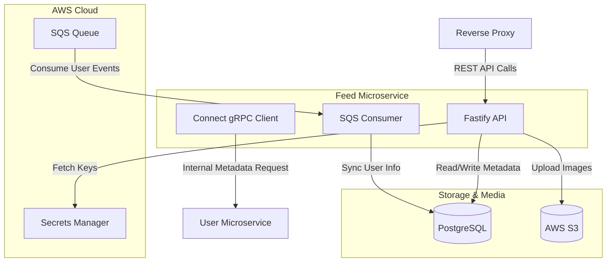

# 🖼️ Udagram Feed Microservice

A specialized microservice for content management, media processing, and social feed orchestration, built with **Fastify** and integrated with **AWS Cloud** services.

---

## 🚀 Overview

The **Feed Service** is the core content engine of Udagram. It manages the lifecycle of posts, including metadata storage in PostgreSQL and binary asset management in AWS S3, while maintaining high performance through asynchronous data synchronization.

### 🌐 Production Access

- **Base API Gateway**: `http://udagramapi.jandir.site/api/v1`
- **Routes Handled**: `/feeds/*`
- **Documentation (Swagger)**: [http://udagramapi.jandir.site/docs](http://udagramapi.jandir.site/docs)

### Key Responsibilities

- **Feed Management**: CRUD operations for user posts with support for image metadata.
- **Media Handling**: Secure multi-part uploads directly integrated with **AWS S3**.
- **Data Enrichment**: Proxies requests to the **User Service** via **gRPC/Connect** to fetch real-time user metadata without exposing the User API to the public.
- **Asynchronous Sync**: Consumes **AWS SQS** messages to keep local user profile cache in sync with the Identity Provider (User Service).

---

## 🛠 Tech Stack & Technical Choices

| Technology             | Purpose            | Rationale                                                                                               |
| :--------------------- | :----------------- | :------------------------------------------------------------------------------------------------------ |
| **Fastify**            | Service Engine     | High throughput and efficient memory management, crucial for a content-heavy service.                   |
| **AWS S3**             | Object Storage     | Reliable, highly available storage for user-uploaded images.                                            |
| **AWS SQS**            | Message Consumer   | Decouples the Feed service from User updates, ensuring eventual consistency without performance impact. |
| **Drizzle ORM**        | Data Orchestration | Provides type-safe access to PostgreSQL for complex feed queries.                                       |
| **Connect RPC**        | Internal Client    | Enables strongly-typed, low-latency communication with the User Service.                                |
| **Pino & Pino-Pretty** | Structured Logging | Highly efficient logging system configured for both developer DX and production observability.          |

---

## 📊 Service Dependency Graph



## 🏗 Architecture Details

### Media Workflow

1. Client sends a **Multipart/Form-Data** request with an image.
2. Feed Service processes the stream and uploads the buffer to **AWS S3**.
3. Image URL and metadata are persisted in **PostgreSQL**.

### Data Synchronization (Pub/Sub)

To avoid excessive cross-service calls, the Feed Service maintains a denormalized cache of user information. It listens to a "User Updated" event via **AWS SQS**. When a user changes their profile picture or name in the User Service, the Feed Service automatically updates its local database to reflect these changes across all existing posts.

### Stateless Security

Adheres to the **Public Key Infrastructure (PKI)** pattern. The Feed Service only possesses the **JWT Public Key**. It verifies the identity of the requester without ever needing to communicate with a central Auth server, ensuring maximum horizontal scalability.

---

## 📡 API Endpoints (v1)

- `GET /api/v1/feeds` - List all feed items (paginated).
- `POST /api/v1/feeds` - Create a new post with image upload (multipart/form-data).
- `GET /api/v1/feeds/:feedId` - Get details of a single feed item.
- `DELETE /api/v1/feeds/:feedId` - Delete a feed item by ID.

---

## 🧪 Development & Testing

Engineered for reliability with comprehensive test suites using **Vitest**.

```bash
# Run development server
npm run dev

# Run unit and integration tests
npm test

# Check code coverage
npm run test:coverage
```

---

## ☁️ Deployment

Fully containerized and optimized for **Kubernetes (EKS)** deployment.

- **Auto-healing**: Configured with Liveness and Readiness probes.
- **Resource Management**: Strict CPU/Memory requests and limits for cluster stability.
- **Secrets Architecture**: Production secrets (AWS Keys, SQS URLs) are never committed; they are fetched at runtime from **AWS Secrets Manager**.
