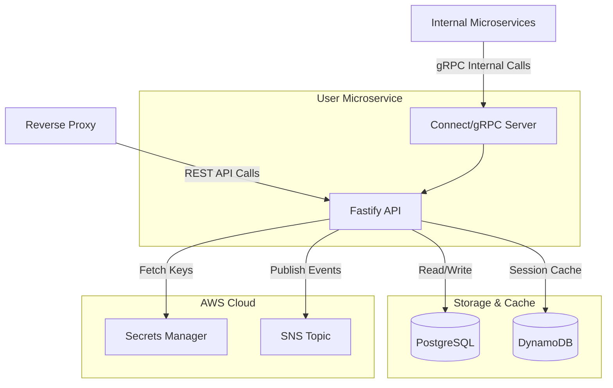

# 👤 Udagram User Microservice

A high-performance, cloud-native microservice built with **Fastify** and **TypeScript**, responsible for identity management, authentication, and user profile orchestration within the Udagram ecosystem.

---

## 🚀 Overview

The **User Service** acts as the Identity Provider for the Udagram platform. It handles the complete user lifecycle—from secure registration and authentication to profile management and inter-service event notification.

### 🌐 Production Access

- **Base API Gateway**: `http://udagramapi.jandir.site/api/v1`
- **Routes Handled**: `/auth/*`, `/users/*`
- **Documentation (Swagger)**: [http://udagramapi.jandir.site/docs](http://udagramapi.jandir.site/docs)

### Key Responsibilities

- **Identity Management**: Secure storage and retrieval of user profiles using PostgreSQL.
- **Authentication**: JWT-based auth flow using **RS256** asymmetric encryption.
- **Inter-service Communication**: Exposes a **gRPC-compatible API** via the **Connect Protocol** for low-latency internal calls (e.g., retrieving user info for the Feed service).
- **Event-Driven Architecture**: Publishes user updates to **AWS SNS** for downstream synchronization (Fan-out pattern).

---

## 🛠 Tech Stack & Technical Choices

| Technology              | Purpose           | Rationale                                                                                                 |
| :---------------------- | :---------------- | :-------------------------------------------------------------------------------------------------------- |
| **Fastify**             | Web Framework     | Chosen for its extremely low overhead and powerful plugin architecture.                                   |
| **Connect Protocol**    | RPC Framework     | Provides gRPC compatibility over HTTP/1.1 and HTTP/2, enabling seamless service-to-service communication. |
| **Drizzle ORM**         | Data Access       | Type-safe SQL orchestration with PostgreSQL, ensuring high performance and developer productivity.        |
| **DynamoDB**            | Session Cache     | Leveraged for high-scale token blacklisting and temporary session storage.                                |
| **Zod**                 | Validation        | Single source of truth for schema validation and TypeScript type safety.                                  |
| **Argon2**              | Password Hashing  | Current industry standard for password hashing, resistant to GPU/ASIC attacks.                            |
| **AWS Secrets Manager** | Secret Management | Centralized, secure storage for API keys and JWT private/public keys.                                     |

---

## 📊 Service Dependency Graph



## 🏗 Architecture Details

### gRPC / Connect Integration

Unlike traditional REST-only architectures, this service implements the **Connect Protocol**. This allows the **Feed Service** (or any other internal consumer) to call the User Service using a strongly-typed client, reducing bugs and improving performance while maintaining compatibility with standard HTTP tools.

### Security First

- **Asymmetric JWT (RS256)**: The User Service signs tokens with a private key. Other services only need the public key to verify them, adhering to the principle of least privilege.
- **CORS Management**: Configured for fine-grained origin control.
- **Secure Configuration**: Uses `@fastify/env` with Zod for strict environment variable validation at startup.

---

## 📡 API Endpoints (v1)

### Auth & Lifecycle

- `POST /api/v1/auth/signup` - Create a new user account.
- `POST /api/v1/auth/signin` - Authenticate and receive JWT tokens.
- `POST /api/v1/auth/refresh` - Refresh access token.
- `DELETE /api/v1/auth/signout` - Sign out and invalidate tokens.

### User Profiles

- `GET /api/v1/users/me` - Retrieve current authenticated profile.
- `GET /api/v1/users/:userId` - Retrieve profile by ID.
- `PATCH /api/v1/users/` - Update current user profile.
- `POST /api/v1/users/avatar` - Upload and update profile picture.
- `DELETE /api/v1/users/` - Delete user account.

### RPC Services (Internal)

- `udagram.user.v1.UserService` - Connect/gRPC service for internal metadata retrieval.

---

## 🧪 Development & Testing

The project maintains high code quality standards with automated testing.

```bash
# Run development server
npm run dev

# Run unit tests
npm test

# Generate coverage report
npm run test:coverage
```

---

## ☁️ Deployment

Built to be **Cloud Native**, containerized with **Docker**, and deployed on **AWS EKS**. It includes built-in support for:

- **Healtchecks**: `/health` endpoint for Kubernetes Liveness/Readiness probes.
- **Structured Logging**: Pino logger formatted for CloudWatch integration.
- **Auto-scaling**: Fully compatible with Horizontal Pod Autoscaler (HPA) via CPU/Memory metrics.
